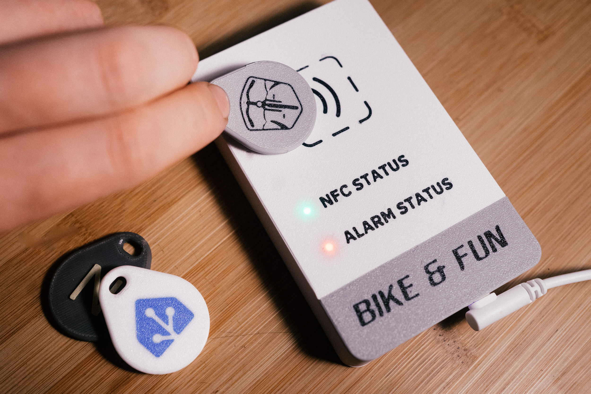
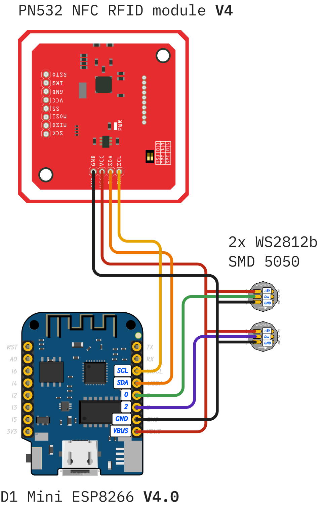
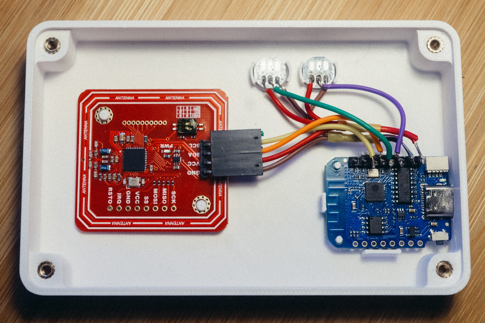

# Tag Reader for Home Assistant
This is based on the fantastic [tagreader](https://github.com/adonno/tagreader) project by adonno.

More Documentation can be found there as well.

---

My version focuses on the usage of this device as an alarm controller for Homeassistant using the [Alarmo](https://github.com/nielsfaber/alarmo) plugin. My tagreader basically only does this:
- arm/disarm alarm in Homeassistant (Alarmo) using NFC keychain tags
- show the current alarm state using the LED
- write NDEF data on new NFC tags

## What I changed:
YAML:
- added second LED for showing alarm state
- added a few light effects for showing states
- added a sensor to fetch current alarm state in Homeassistant
- removed all music related stuff
- removed all buzzer signals

Case:
- made it bigger to have more space for labels/logos
- added a second LED
- added heat set inserts
- added transparent LED channels

## Components
I used the following components:

 - ESP8266 D1 Mini v4.0
 - PN532 NFC Reader v4 (v4 has extended reach, otherwise won't work behind thick windows)
 - 2x WS2812 SMD 5050 Leds

### Connecting the components
> [!IMPORTANT]  
> I used the v4 version of the ESP8266 D1 Mini which has a slightly different pinout than its predecessor.

My wiring can be seen here:

Switches on PN532 need to be set to I2C mode:
- Switch 1: On (up)
- Switch 2: Off (down)

To flash the reader firmware to your D1 Mini you point ESPHome at [tagreader.yaml](tagreader.yaml).  

## Case
made some changes to the original case design. Mainly did that to house the second LED and have some more space at the front of the case for labels and logos.

Step File from Fusion are [here](/CAD%20Files/)
